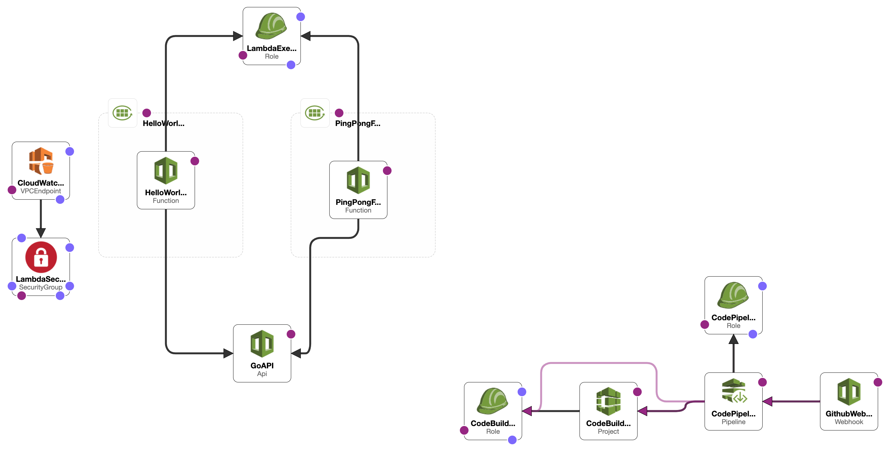

# Go : API Gateway : Lambda
> Example using Go, API Gateway, and Lambda

[](https://github.com/mrz1836/go-api-gateway/actions/)
[](https://golang.org/)
[](https://codecov.io/gh/mrz1836/go-api-gateway)
[](https://github.com/sponsors/mrz1836)
[](https://mrz1818.com/?tab=tips&utm_source=github&utm_medium=sponsor-link&utm_campaign=go-api-gateway&utm_term=go-api-gateway&utm_content=go-api-gateway)

<br/>

## Table of Contents
- [Installation](#installation)
- [Deployment & Hosting](#deployment--hosting)
- [Documentation](#documentation)
- [Examples & Tests](#examples--tests)
- [Code Standards](#code-standards)
- [Maintainers](#maintainers)
- [Contributing](#contributing)
- [License](#license)

<br/>

## Installation

#### Prerequisites
- [An AWS account](https://aws.amazon.com/) 
    - _Running functions locally_ requires permission to: [CodePipeline](https://aws.amazon.com/kms/) and [KMS](https://aws.amazon.com/kms/)
    - _Deploying_ requires permission to: [KMS](https://aws.amazon.com/kms/), [SSM](https://aws.amazon.com/systems-manager/features/), [Secrets Manager](https://aws.amazon.com/secrets-manager/) and [Cloud Formation](https://aws.amazon.com/cloudformation/)
- [AWS CLI](https://docs.aws.amazon.com/cli/latest/userguide/installing.html) _(`brew install awscli`)_
- [SAM CLI](https://docs.aws.amazon.com/serverless-application-model/latest/developerguide/serverless-sam-cli-install-mac.html) _(`brew tap aws/tap && brew install aws-sam-cli`)_
    - Running functions locally requires: [Docker](https://docs.docker.com/install)
- [Golang](https://golang.org/doc/install) _(`brew install go`)_
- [Docker](https://docker.com/) Used for running the local version of the API and functions
- [DockerHub](https://hub.docker.com/) Used for custom Go images in CodeBuild

Clone or [go get](https://golang.org/doc/articles/go_command.html) the files locally
```shell script
go get github.com/mrz1836/go-api-gateway
cd $GOPATH/src/github.com/mrz1836/go-api-gateway
```

<details>
<summary><strong><code>Setup to run locally</code></strong></summary>
<br/>

**2)** Build and run! (runs on 127.0.0.1:3000)
```shell script
make build;
make start;
``` 
</details>

<br/>

## Deployment & Hosting
This repository has CI integration using [AWS CodePipeline](https://aws.amazon.com/codepipeline/).

Deploying to the `master` branch will automatically start the process of shipping the code to [AWS Lambda](https://aws.amazon.com/lambda/).

Any changes to the environment via the [AWS CloudFormation template](application.yaml) will be applied.
The actual build process can be found in the [buildspec.yml](buildspec.yml) file.

The application relies on [AWS Secrets Manager](https://aws.amazon.com/secrets-manager/)
and [AWS SSM](https://aws.amazon.com/systems-manager/features/) to store environment variables.
Sensitive environment variables are encrypted using [AWS KMS](https://aws.amazon.com/kms/) and then decrypted at runtime.

Deploy different environments by changing the `<stage>` to `production` or `staging` as an example.
The default stage is `production` if not specified.

<details>
<summary><strong><code>Create Environment Encryption Key(s) (AWS)</code></strong></summary>
<br/>

Create a `KMS Key` per `<stage>` for your application(s) to encrypt environment variables
```shell script
make create-env-key stage="<stage>";
```

This will also store the `kms_key_id` in  [SSM](https://aws.amazon.com/systems-manager/features/) located at: `/<application>/<stage>/kms_key_id` 

</details>

<details>
<summary><strong><code>Manage DockerHub Credentials (AWS)</code></strong></summary>
<br/>

- `username` is your DockerHub username
- `password` is either your DockerHub password or auth_token (use auth_token if your account has 2FA)
- `kms_key_id` is from the previous step _(Create Environment Encryption Keys)_

Add or update your application DockerHub credentials
```shell script
make save-dockerhub-credentials \
      username="YOUR_DOCKERHUB_USERNAME" \
      password="YOUR_DOCKERHUB_PASSWORD" \
      kms_key_id="YOUR_KMS_KEY_ID" \
      stage="<stage>";
```

Next run:
```shell
make save-dockerhub-arn \
      arn="YOUR_SECRETS_ARN" \
      stage="<stage>";
```
</details>

<details>
<summary><strong><code>Manage Environment Secrets (AWS)</code></strong></summary>
<br/>

- `github_token` is a GitHub Personal Token for webhooks
- `kms_key_id` is from the previous step (Create Environment Encryption Keys)

Add or update your GitHub personal access token
```shell script
make save-secrets \
      github_token="YOUR_GITHUB_TOKEN" \
      example_secret="YOUR_EXAMPLE_SECRET_VALUE" \
      kms_key_id="YOUR_KMS_KEY_ID" \
      stage="<stage>";
```
</details>

<details>
<summary><strong><code>Create New CI & Hosting Environment (AWS)</code></strong></summary>
<br/>



This will create a new [AWS CloudFormation](https://aws.amazon.com/cloudformation/) stack with:
- (1) [API Gateway](https://aws.amazon.com/api-gateway/) RESTful API interface
- (1) [Lambda](https://aws.amazon.com/lambda/) Function(s) (Golang Runtime)
- (1) [CloudWatch LogGroup](https://aws.amazon.com/cloudwatch/) for the Lambda function output
- (1) [CodePipeline](https://aws.amazon.com/codepipeline/) with multiple stages to deploy the application from GitHub
- (1) [CodePipeline Webhook](https://aws.amazon.com/codepipeline/) to receive GitHub notifications from a specific `branch:name`
- (1) [CodeBuild Project](https://docs.aws.amazon.com/codebuild/latest/userguide/create-project.html) to test, build and deploy the app
- (2) [Service Roles](https://docs.aws.amazon.com/IAM/latest/UserGuide/id_roles_create_for-service.html) for working with CodeBuild and CodePipeline

**NOTE:** Requires an existing S3 bucket for artifacts and sam-cli deployments (located in the [Makefile](Makefile))

One command will build, test, package and deploy the application to AWS using the default `production` stage and using default tags. 
After initial deployment, updating the function is as simple as committing to GitHub.
```shell script
make deploy;
```

_(Example)_ Customized deployment for another stage
```shell script
make deploy stage="development" branch="development";
``` 

_(Example)_ Customized deployment for a feature branch
```shell script
make deploy stage="development" branch="some-feature" feature="some-feature";
```

_(Example)_ Customized S3 bucket location
```shell script
make deploy bucket="some-S3-bucket-location";
```

_(Example)_ Customized tags for the deployment
```shell script
make deploy tags="MyTag=some-value AnotherTag=some-value";
```  
</details>

<details>
<summary><strong><code>Tear Down CI & Hosting Environment (AWS)</code></strong></summary>
<br/>

Remove the stack (using default stage: `production`)
```shell script
make teardown;
```   

_(Example)_ Teardown another stack via stage
```shell script
make teardown stage="development";
``` 

_(Example)_ Teardown a feature/branch stack
```shell script
make teardown stage="development" feature="some-feature";
``` 
</details>

<details>
<summary><strong><code>Lambda Logging</code></strong></summary>
<br/>

View all the logs in [AWS CloudWatch](https://console.aws.amazon.com/cloudwatch/home?region=us-east-1#logsV2:log-groups) via Log Groups
```text
/aws/lambda/<app_name>-<stage_name>
```
</details>

<br/>

## Documentation

<details>
<summary><strong><code>Release Deployment</code></strong></summary>
<br/>

[goreleaser](https://github.com/goreleaser/goreleaser) for easy binary or library deployment to GitHub and can be installed via: `brew install goreleaser`.

The [.goreleaser.yml](.goreleaser.yml) file is used to configure [goreleaser](https://github.com/goreleaser/goreleaser).

Use `make release-snap` to create a snapshot version of the release, and finally `make release` to ship to production.
</details>

<details>
<summary><strong><code>Makefile Commands</code></strong></summary>
<br/>

View all `makefile` commands
```shell script
make help
```

List of all current commands:
```text
aws-param-certificate           Returns the ssm location for the domain ssl certificate id
aws-param-dockerhub             Returns the ssm location for the DockerHub ARN
aws-param-zone                  Returns the ssm location for the host zone id
build                           Build the SAM application
clean                           Remove previous builds, test cache, and packaged releases
clean-mods                      Remove all the Go mod cache
coverage                        Shows the test coverage
create-env-key                  Creates a new key in KMS for a new stage
create-secret                   Creates an secret into AWS SecretsManager
decrypt                         Decrypts data using a KMY Key ID (awscli v2)
decrypt-deprecated              Decrypts data using a KMY Key ID (awscli v1)
deploy                          Build, prepare and deploy
diff                            Show the git diff
encrypt                         Encrypts data using a KMY Key ID (awscli v2)
env-key-location                Returns the environment encryption key location
generate                        Runs the go generate command in the base of the repo
godocs                          Sync the latest tag with GoDocs
help                            Show this help message
install                         Install the application
install-go                      Install the application (Using Native Go)
install-releaser                Install the GoReleaser application
invalidate-cache                Invalidates a cloudfront cache based on path
lint                            Run the golangci-lint application (install if not found)
package                         Process the CF template and prepare for deployment
release                         Full production release (creates release in Github)
release-snap                    Test the full release (build binaries)
release-test                    Full production test release (everything except deploy)
replace-version                 Replaces the version in HTML/JS (pre-deploy)
save-dockerhub-arn              Updates the ARN for the DockerHub secret
save-dockerhub-credentials      Helper for saving DockerHub credentials to Secrets Manager
save-domain-info                Saves the zone id and the ssl id for use by CloudFormation
save-param                      Saves a plain-text string parameter in SSM
save-param-encrypted            Saves an encrypted string value as a parameter in SSM
save-secrets                    Helper for saving application secrets to Secrets Manager (extendable for more secrets)
start                           Start the application
tag                             Generate a new tag and push (tag version=0.0.0)
tag-remove                      Remove a tag if found (tag-remove version=0.0.0)
tag-update                      Update an existing tag to current commit (tag-update version=0.0.0)
teardown                        Deletes the entire stack
test                            Runs lint and ALL tests
test-ci                         Runs all tests via CI (exports coverage)
test-ci-no-race                 Runs all tests via CI (no race) (exports coverage)
test-ci-short                   Runs unit tests via CI (exports coverage)
test-no-lint                    Runs just tests
test-short                      Runs vet, lint and tests (excludes integration tests)
test-unit                       Runs tests and outputs coverage
uninstall                       Uninstall the application (and remove files)
update-linter                   Update the golangci-lint package (macOS only)
update-secret                   Updates an existing secret in AWS SecretsManager
upload-files                    Upload/puts files into S3 bucket
vet                             Run the Go vet application
```
</details>

<br/>

## Examples & Tests
All unit tests run via [GitHub Actions](https://github.com/mrz1836/go-api-gateway/actions) and
uses [Go version 1.20.x](https://golang.org/doc/go1.20). View the [configuration file](.github/workflows/run-tests.yml).

Run all tests (including integration tests)
```shell script
make test
```

Run unit tests (excluding integration tests)
```shell script
make test-short
```

<br/>

## Code Standards
Read more about this Go project's [code standards](.github/CODE_STANDARDS.md).

<br/>

## Maintainers

| [](https://github.com/mrz1836) |
|:------------------------------------------------------------------------------------------------:|
|                                [MrZ](https://github.com/mrz1836)                                 |

<br/>

## Contributing
View the [contributing guidelines](.github/CONTRIBUTING.md) and please follow the [code of conduct](.github/CODE_OF_CONDUCT.md).

### How can I help?
All kinds of contributions are welcome :raised_hands:!
The most basic way to show your support is to star :star2: the project, or to raise issues :speech_balloon:.
You can also support this project by [becoming a sponsor on GitHub](https://github.com/sponsors/mrz1836) :clap:
or by making a [**bitcoin donation**](https://mrz1818.com/?tab=tips&utm_source=github&utm_medium=sponsor-link&utm_campaign=go-api-gateway&utm_term=go-api-gateway&utm_content=go-api-gateway) to ensure this journey continues indefinitely! :rocket:

[](https://github.com/mrz1836/go-api-gateway/stargazers)

## License

[](LICENSE)
